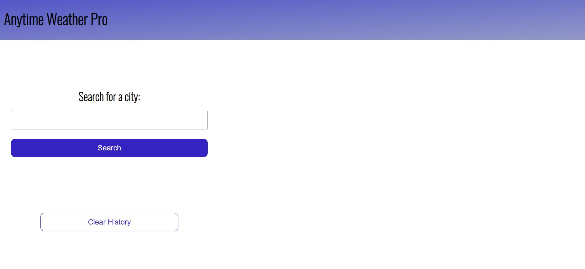
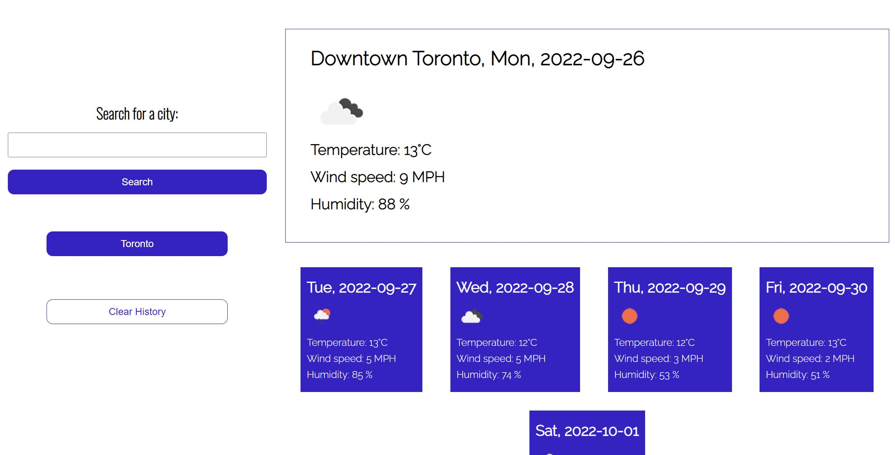
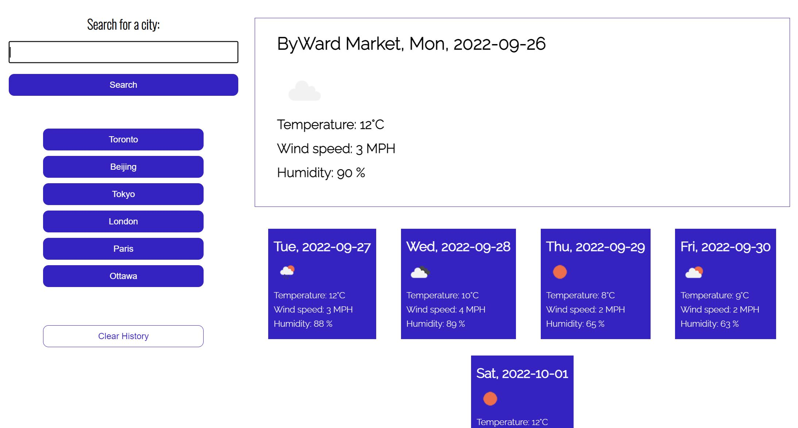

# Weather-Dashboard

Bootcamp module 6 challenge - making a weather dashboard webpage to display weather conditions of a selected city.

## Description

- My goal was to make a weather forecast app using the OpenWeatherMap API.
- The free tier of the API provides weather data in 3-hour marks for 5 days.
- When the user makes a search, the data fetched from the API will be converted into daily averages for each of the 5 days.
- The after noon weather condition of each day will be used to determine which weather icon to use.
- Another API was also used to get the weather info for the current day.
- Note that these API only take geo coordinates (latitude & longitude), so when a user types in a city name it then will need to be converted into geo coordinates with the help of the GeoCoding API.
- Every search by city name will be saved to a list, so the user can easily check updated weather conditions for that city anytime.

## Usage

- Before rendering any information, the page will only show a form where a user can input a city name:
  ;

- After a search and when the data is returned by the API, the current day weather and the future 5-day weather forecast will be display on the right side of the page:
  ;

- All city names searched will be saved:
  ;

## Links

- Link to this project's Github repo: https://github.com/BranBao1995/Weather-Dashboard

* Link to the project site: https://branbao1995.github.io/Weather-Dashboard/
